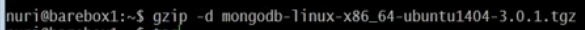
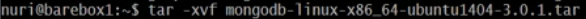
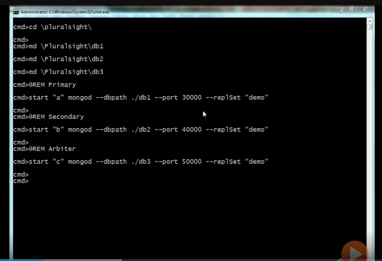
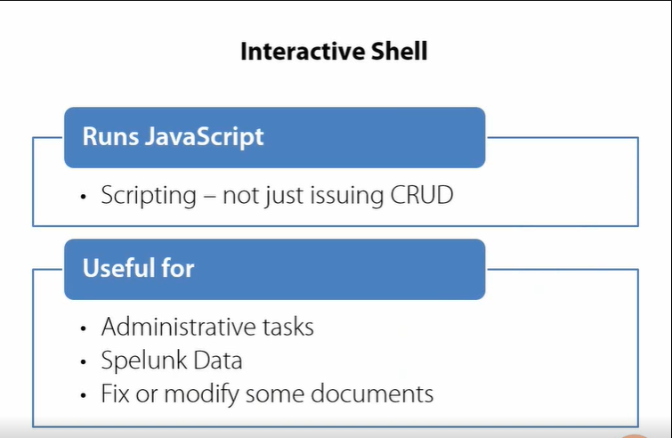
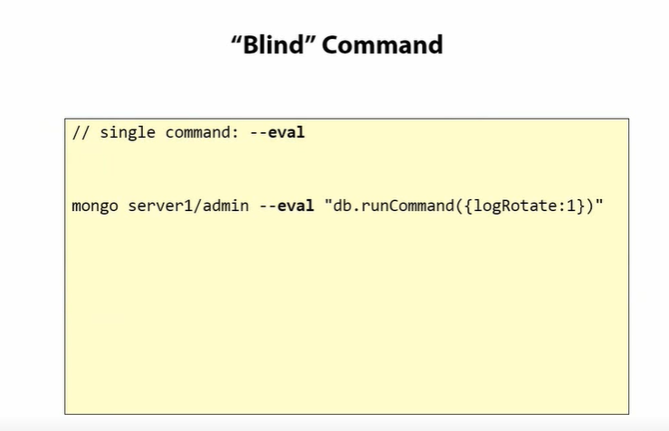
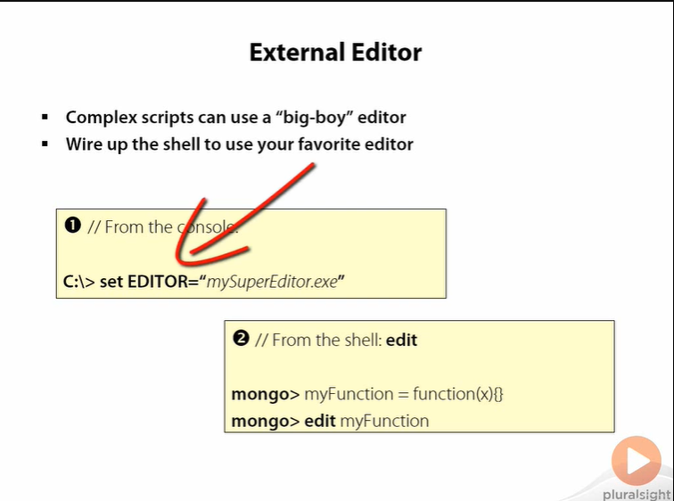
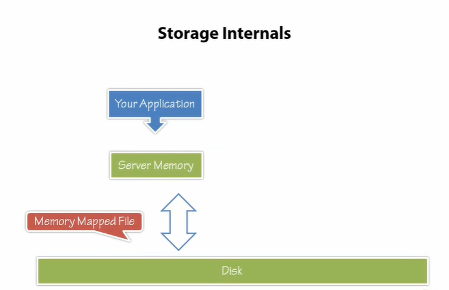
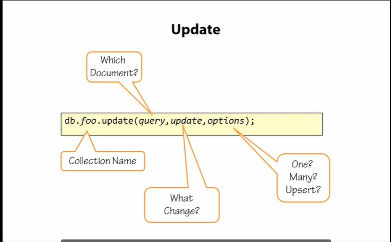
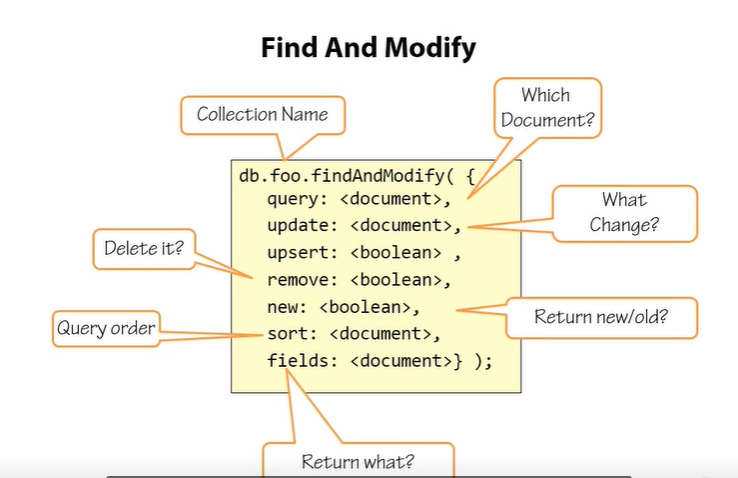

# What is mongo DB?
MongoD --> Is the server.
mongo ---> Is the shell.
1. Install It.

2. Unzip It.

3. Extract using tar

4. Add bin to the path


#### File System Type

Use ext4 or exfs , ext3 not recommended as it takes a lots of time to allocate files and mongo frequently ask for larger files.

to check the file system in linux

````
> mount
````

#### Disable Last Access Time
due to lots of Disk IO Operation use should desable it.

````
sudo vi /etc/fstab
````
add just after the defaults

````
defaults.noatime
````
:q and reboot the system and type to check

````
>mount
````

### install using package manager

install using open source distribution using package manager

1. need to have a public key 
````
sudo apt-key adv --keyserver hkp://keyserver.ubuntu.com:80 --recv 7F0CEB10 
````

for more please check the docs man!!
on docs.mongodb.org
 
now 

1. Binaries are in `usr/bin`;
2. .conf in `/etc` you can check with `ls -l /etc/mongod.conf`;
3. actual mongo specific service startup config script files lives in `/etc/init/mongod.conf`;
   you cab check with `more /etc/init/mongod.conf`;


# Some Usefull CMD options

``>mongo --help | more`` 

for adding more option while runnig a mongo server are basically done with a .conf file 
i.e.
- mongo-db.conf
````
# data file resides
dbpath=/myfolder/db

#where log files resides 
logpath=/myfolder/mongo-servers.log

#how verbose the server will be logging
verbose=vvvvv //1 to 5
````

- runnig with the file

````
>mongod -f C:\Path\to\the\file
````

## Install mongo as a service 

````
>mongod -f C:\Path\to\the\file --install
````
- start the service 

````
>net start mongodb
````

- Check wather a service is running in the current machine

for windows

````
>net start | findstr Mongo

````

- For stoping the service 

````
>net stop mongodb
````


## Verify Server 

if you are useing mongo with default conf then you don't need to pass any CMD args

- To connect the mongo shell

````
>mongo
````

## Concept of the database in mongo

- show databases with `>show dbs`;
- check which dadabase are you in now `>db`;
- to go with diffrent databasec `>use database_name`;
- check as many administartive commands `>help`;

## Single server is DANGER (Replica Sets).

For this mongo have the replica set, and this is important for autorecovery. a minimal replical set have possible at leat 3 servers. we have to run each of them in a differnt TCP port so that they can easyly talk with each other.  
members are 
- Primary : One and only writable instance.all the clients have to conected with primary and have to write primary.
- Secodary : Read only instances Number of Secondary can have .In secondary databases data with we replicated Eventually that what the term known as "Eventually Replication" once a p faild s can take place of p (at least more the 50%).
-  (Arbiter DataBase) : Arbiter dont have data in it.it is a tie breaker in election  Once primay dataBase failes there is a concept of voting .
    - if we have one "p" one "s" and "p" fails "s" will not became "p".
    - if we have one "p" one "s" and one "a" then "a"  will vote for s as "a" can't vote for himself.

### Configure a Replica Set

we need atleat three directories

````
>md \mydir\db1
>md \mydir\db2
>md \mydir\db3

@REM Primary
start "a" mongod --dbpath ./db1 --port 30000 --replSet "demo"

@REM Secondary
start "b" mongod --dbpath ./db2 --port 40000 --replSt "demo"

@REM Arbiter
start "c" mongod --dbpath ./db3 --port 50000 --replSet "demo"

````




- As we start the server not in a default port so 

````
`mongo --port 30000
````

- To check which server we are connecting to

````
> db.getMongo()
````
- Now, Configure the Replica set, Mongo Sell is a javaScript Interprater , so we will create an Object

````
const demoConfig={
    "_id":"demo",
    "members":[
        {
            "_id":0,
            "host":"localhost:30000"
            "priority":10
        },
        {
            "_id":1,
            "host":"localhost:40000"
        },
        {
           "_id":2
           "host":"localhost:50000",
           "arbiterOnly":true
        }
    ]
}
>rs.initiate(demoConfig)
demo:RRIMARY>
````

## Reading data form the secondary database

we need to do one more thing before 

``db.setSlaveOk() // this is also a connection level setting.``

``rs.help();``


# Mongo Shell
Shell is symply an application that allows you to interactively get insite of what the Mongo server is doing. 

## Shell Role in Ecosystem


## Using eval 

besids runnig a batch file we can just pass a cmd option --eval

 
It can load a js file if operations are quite complex

``>mongo server1 myDailyChores.js ``
``>mongo server1 myDailyChores.js --shell`` // run script inside the terminal ??


## Shell key shourcut


## Adding favorite Editor 




# Storing Data In mongoDB



There are three basic things to be understood

1. Storage 
The question is how data stored by the Engine?

Our application wants to interact with some information , That information is in the memory in your application It then talks to the server and the server has the priminant storag namly the disk now, the question is , who does the engin stores the data?

     Mongo useg memory-mapped-files the serevr can not store all the information in the memory but it would like to think of information as just existing and being avilable to it in any given moment so what is does ? it creates a humungous array and maps it using memory-map-files whnever its calls into play portion of that array the os takes care of loading or saving it to the disk . when you wanna store a bit of information you handed over to the server the server scribbled (gaseetna) it over in memory , and that maemory gets managed and serialized to disk the same process in revers happens when you wanna read data, the server will attempt to access the a protion of the large byte array which will be loaded as needed from the os, it's really a good idea to laverage this os funtionality . Because it's a core os function , it's being highly optemized, it's really fast and its really stable so the Mongo DB server does not have to take care of thoes issues and can focus on serving data

Ok , so bytes array can  be stored in the disk, now you data your documant with scema get saved , and what formate does it get ssaved ?
  The answer is , BSON . The BSON for more about spacification you can follow bsonspec.org

- BSON elementry datatype need very small marselling into memory in c data type. thats make reading and writing really fast in many of 
- BSON documents are very easy to travers , they are very easy to skip over because there is length prefixing, 

- it's very easy to drill into a document and find perticular fields.

- there is sligth overhead in the field name storage, but it is how a BSON doucument structure remains scema-less. 

- BSON spec is very efficient data storage serialization format and MongoDB is taking advantages of mamory mapped files .
put altogether, the overhead of martialing your data to disk and the usage of that data format in the servers is very efficient that's makes it a very fast data storag engin.

## Saving data in mongo

1. A document must have an _id field and must spelled the same.
2. The size of a document in mongo currently is of 16MB if you need more the break it in multiple document.
3. In mongo there are collectios besides the tables.

#### Collections 
A Collection in Mongo defines the scope of interaction with documents so you can issue commands against a specific collection to store and retrive data. Because this is not a relational database , you can not issue commends accross several collections.

````
>db.foo.save({_id:1,x:10});// db=='current DB', foo == 'collection' 
````

````
>show collections
````

there should be two collections 

1. foo.
2. system.indexes.

for fast retiving we should have Index on that id. you can get the scema of system.indexes by `db.system.indexes.find()`;

#### datatype can be stored in ID filed

````
>db.foo.save({_id:1});
>db.foo.save({_id:3.14});
>db.foo.save({_id:"hello"});
>db.foo.save({_id:ISODate()});
>db.foo.save({_id:{a:'x',b:2}});

````
`You can't use array as a datatype in ID in Mongo but if you convert it into the byte DS by bin data structure then you can do this too`;

#### Mongos ObjectId

- you can get a new objectId using the objectId() function.
- every object id contains a timestemp inside it and we can get is by `objectId().getTimestemp()`.
- objectId is like a binary gobbledygook. it include a time stamp and other bits.
- hence using a objectId give you a roughly asending order wich eliminates all the b-tree like structures.it give really fast insertions.
- if you wants faster reads though you migth wanna choose a diffrent id which gives you better proximity of several documents.
- if you store the document with the same _id it will be overwritten.`you can use >db.bla.insert({_id:1,name:'bob'})` will prevent you the overwrite and throw an error.
- id is given by either the shell or the mongo driver.

`scema less nesss allows you to get much more flexible objects that can serve very complex bussiness logics and it is encorraged to have totall isolated documents inside a collections wich is really helpfull for avoiding the conditions of undefied and nulls`;

#### Save Danger 

there is concurrancy managemnet issue and there is no versaning buid in and I can't hold the recored with a lock for a long time 

````
>db.a.save({_id:1,x:10});
>var doc = db.a.findOne({_id:1});
>doc.x = doc.x+1;
>db.a.save(doc);
>db.a.save({_id:1,x:10,y:3});
>db.a.save(doc);
````


the solution is `Mongo Update Command`;
Update command is Atomic with in a document one if two upadte command execute at the same time it will run once the first one is completed.




````
>db.a.save({_id:1,x:10});
>db.a.update({_id:1},{$inc:{x:1}})// here {$inc:{x:1}} is the increment operator 
>db.a.find();
````

#### set Operator
one client whants to add a field and other one just want to increment

````
>db.a.save({_id:1,x:10});
>db.a.update({_id:1},{$set:{y:3}});
>db.a.update({_id:1},{$inc:{x:1}});
````


#### unset Operator

````
db.a.update({_id:1},{$unset:{y:''}});
````

#### rename Operator

````
db.a.update({_id:1},{$rename:{'naem':'name'}});
````

#### push operator

````
>db.a.update({_id:1},{$push:{things:'one'}});
>db.a.find();
//{"_id":1,"things":["one"]}

````
for removing the redundancy 

````
>db.a.update({_id:1},{$addToSet:{"things":"four"}});
````

#### pull Operator

````
>db.a.update({_id:1},{$pull:{"things":"three"}});// remove all instanses of the array elements.
````

#### pop Operator

````
>db.a.update({_id:1},{$pop:{things:1}})// will pop out last one element from the array.
>db.a.update({_id:1},{$pop:{things:-1}})// will pop out first element from the array. 
````

if we do it multiple times it will succseed and do nothing will remains with an empty array.


#### Multi Update

````
db.a.update({},{$push:{things:4}});// by this only one record will be updated
db.a.update({},{$push:{things:4},{multi:true}});
````
update a doc with value 2 in it 
````
db.a.update({things:2},{$push:{things:42}},{multi:ture});
````

#### Find and modify




